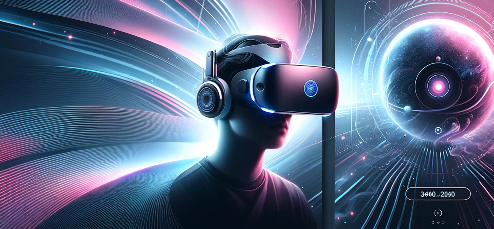

# 성능 개선 보고서

# 성능 전후

## github actions

| 개선 전 | 개선 후 |
| ------ | ------- |
|  |  |


## 배포 이후, 브라우저에서 Lighthouse

| 개선 전 | 개선 후 |
| ------ | ------- |
|  |  |


### 이미지 최적화를 통한 LCP 향상

- 기존의 jpg, png의 이미지 파일을 모두 webp로 변환
- picture+source와 디바이스별 최적화된 이미지 불러오도록 변경
  ```html
  <picture>
    <source
      class="mobile"
      media="(max-width: 576px)"
      srcset="images/Hero_Mobile.webp"
    />
    <source
      class="tablet"
      media="(max-width: 960px)"
      srcset="images/Hero_Tablet.webp"
    />
    
  </picture>
  ```
- 바로 랜딩하는 이미지가 아닌 요소에 대해 lazy적용
  ```html
  <imgAdd
    commentMore
    actions
    src="images/vr1.webp"
    alt="product: Penom Case"
    loading="lazy"
  />
  ```

### defer를 적용하여 스크립트의 로드 지연

```html
<script defer type="text/javascript" charset="UTF-8">
  document.addEventListener("DOMContentLoaded", function () {
    cookieconsent.run({
      notice_banner_type: "simple",
      consent_type: "express",
      palette: "light",
      language: "en",
      page_load_consent_levels: ["strictly-necessary"],
      notice_banner_reject_button_hide: false,
      preferences_center_close_button_hide: false,
      page_refresh_confirmation_buttons: false,
      website_name: "Performance Course",
    });
  });
</script>
```

### SEO를 위한 작업

- image에 alt를 명시
- 미작성된 meta태그인 description을 추가

```html
<metaAdd
  commentMore
  actions
  name="description"
  content="Explore the latest VR headsets and accessories. Shop best-selling virtual reality products from Apple, Oculus, PlayStation, and more. Subscribe for exclusive deals."
/>
```

---

## 최적화 진행을 진행하며, 성능적으로 큰 개선이 되었던 요소

### 이미지의 확장자 변경

이미지의 확장자를 webp로 변환만 하여도 크게 최적화가 적용됨을 확인했습니다.

(performance: 기존 81-> 97)

(lcp: 2.9s -> 1.2s)

### image alt와 meta태그 적용

image에 누락된 alt를 명시하고, meta태그에 description을 작성하는것으로 SEO에서 100점을 받을 수 있었습니다.
